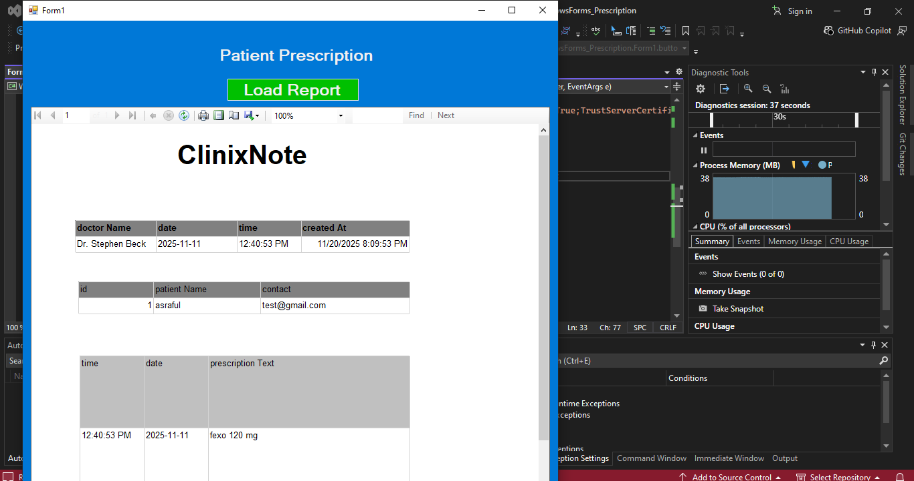

📄 Clinical Prescription Report using RDLC (Crystal Report Style)

This project demonstrates how to generate a Clinical Prescription Report using RDLC reporting in a .NET application.
The design follows a structure similar to a Crystal Report layout, providing a printable and professional prescription document for clinical use.

🏥 Project Overview

The purpose of this module is to generate a doctor’s prescription in report format using RDLC (Report Definition Language Client-side).
Doctors can enter patient details, diagnosis, and medication; the system then generates a printable prescription.

✨ Features

Generate clinical prescription reports using RDLC.

Structured layout similar to Crystal Reports.

Displays:

>Patient Information

>Doctor Information

>Prescription Date

>Diagnosis / Findings

>Prescribed Medicines

>Instructions

>Fully printable format (A4).

Dynamic data binding from database or manually entered values.

Supports export to:

PDF

Word

Excel

🖼️ Report Preview (Screenshot)

Below is a screenshot of the prescription report design:

🛠 Technologies Used

>Microsoft RDLC Report

>.NET / C# WinForms or ASP.NET

>ReportViewer Control

>Microsoft SQL Server

📁 Project Structure
/ProjectRoot
│── /Reports
│     └── PrescriptionReport.rdlc
│── /Images
│     └── report.png
│── Program.cs
│── README.md

⚙️ How It Works
1️⃣ Create the RDLC Report

Add a new RDLC file

Insert tables, text fields, and labels

Bind dataset fields (e.g., PatientName, Age, MedicineList)
